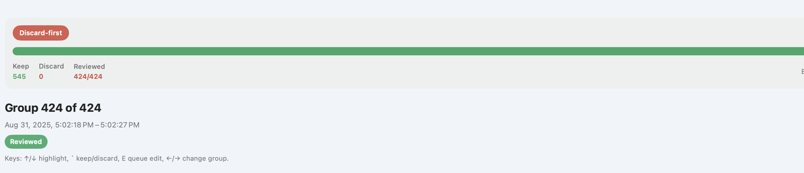

# Photos Library Sort Helper (macOS)

Photos Library Sort Helper is a personal/hobby macOS app built for my own media triage workflow. It exists primarily to satisfy my own needs; public usefulness is incidental. No warranty, support commitment, stability guarantee, or roadmap promise is implied beyond the actual license.

`Media-Sort-Helper` is now retired. This repo is the replacement for both the old Photos-only app and the older folder-based experiment.

## What It Does

- Reviews similar media from either:
  - your Apple Photos library, or
  - a regular folder of image/video files.
- Uses discard-first manual review only. The app does not auto-pick a keeper.
- Lets you review one group at a time, decide what to keep, and queue follow-up work safely.
- Supports two follow-up destinations:
  - `Files to Edit`
  - `Files to Manually Delete`
- In folder mode, those destinations are sibling folders beside the selected root folder, and nested paths are preserved.
- In folder mode, kept files stay in place by default. There is an explicit toggle if you also want reviewed keeps moved into a sibling `Keep` folder.

## Safety Guarantees

- No automatic deletion.
- No direct destructive delete action from this app.
- No file-level writes into the Photos library package.
- No Photos prompt at app launch. The app asks only when you explicitly start a Photos scan or queue Photos album changes.
- Folder writes are explicit and user-initiated, happen only from the commit summary, and preserve relative subfolder structure.
- Marked discards go to `Files to Manually Delete` for final human review.

## Distribution Caveats

- The packaged `.app` is code-signed ad hoc for local use, but it is **not notarized** for public macOS distribution.
- This is a personal-use app. I am intentionally not paying for Apple Developer Program notarization for this project right now.
- The build script produces a **universal** app bundle intended to run on both Apple Silicon and Intel Macs running macOS 14 or later.
- If macOS blocks the app on first launch, use normal platform UI:
  - In Finder, Control-click the app and choose **Open**.
  - If needed, open **System Settings > Privacy & Security** and use **Open Anyway** for the blocked app.

## Install Prerequisites

1. Install **Xcode** from the Mac App Store.
2. Open Xcode once and accept the license.
3. In Terminal, run:

```bash
sudo xcode-select -s /Applications/Xcode.app/Contents/Developer
```

## Run In Xcode

1. Open this folder in Xcode:

```bash
open Package.swift
```

2. In Xcode, click the Run button.

## Build A Standalone App

To build a double-clickable universal app bundle and DMG in `dist/`:

```bash
cd /path/to/repo
./scripts/build_app.sh
```

This creates:

- `dist/Photos Library Sort Helper.app`
- `dist/PhotosLibrarySortHelper-macos-universal.dmg`

The packaged app keeps the source-controlled version and build number from `Resources/Info.plist`; the build script does not auto-bump them.

If you are intentionally preparing a release version, bump the tracked version/build first:

```bash
./scripts/bump_release_version.sh
```

## How To Use

### Photos Library mode

1. Launch the app and keep `Photos Library` selected.
2. Choose `All Photos` or a specific album.
3. Optionally narrow the scope with a date range.
4. Click **Scan for Similar Media**. macOS will ask for Photos access at that point if needed.
5. Review one group at a time.
6. Use `E` or the edit action when a highlighted item should go into `Files to Edit`.
7. Use **Open Summary and Queue** when you are ready to queue keeps/discards into Photos review albums.

### Folder mode

1. Switch the source type to `Folder`.
2. Click **Choose Folder...** and pick the root folder you want to review.
3. Click **Scan for Similar Media**.
4. Review one group at a time.
5. Use `E` to mark a highlighted item for the `Files to Edit` folder commit queue.
6. Open the summary and review the exact destination paths and sample relative paths.
7. Commit only when you are ready to move queued items into sibling folders beside the selected root.



## Review Workflow

- The app is tuned for discard-first manual review.
- Each group starts with no automatic keeper selection.
- You decide what to keep, what to discard, and what should be queued for later follow-up.
- Users should not expect automatic culling or AI-led keep/discard decisions.

## Local Data And Storage

- Review session state is stored locally at:
  - `~/Library/Application Support/com.jkfisher.photoslibrarysorthelper/review-session-v2.json`
- Scan preferences are stored locally at:
  - `~/Library/Application Support/com.jkfisher.photoslibrarysorthelper/scan-preferences-v2.json`
- Folder selections are stored in the preferences file using bookmark-backed data plus the resolved path.
- If you are upgrading from the old `Photo Sort Helper` identity, the app migrates previous local session and preference data into the current bundle identifier.
- If you are upgrading from older `Media-Sort-Helper` habits, there is no separate app state to keep using; this repo/app is now the canonical path forward.
- The app may request iCloud-backed assets through PhotoKit when thumbnails, previews, or videos are needed, but it does not upload your media to any third-party service.

## Troubleshooting And Limits

- If macOS blocks the standalone app on first launch, use Finder **Open** or **System Settings > Privacy & Security > Open Anyway**. The app is ad-hoc signed, not notarized.
- If the app cannot see your library, check Photos permission in **System Settings > Privacy & Security > Photos**.
- If folder mode cannot reopen a previously selected folder, choose it again so the bookmark/path reference can be refreshed.
- Large scans can take a while, especially when PhotoKit needs to fetch iCloud-backed assets for thumbnails, previews, or videos.
- Folder-mode commits move files only when you explicitly confirm from the summary sheet.
- The app does not delete anything for you, does not sync to any remote service, and does not auto-cull in the background.
- On macOS, PhotoKit exposes a single Photos authorization for both reading the library and user-initiated album changes, so the app defers that prompt until you explicitly begin Photos review work.
- Similarity threshold is fixed at `12.0` for consistent grouping. If results feel too broad or too narrow, adjust `Max time gap`.
- Current project status and the latest durable rollback anchor are summarized in `docs/WHERE_WE_STAND.md`.
